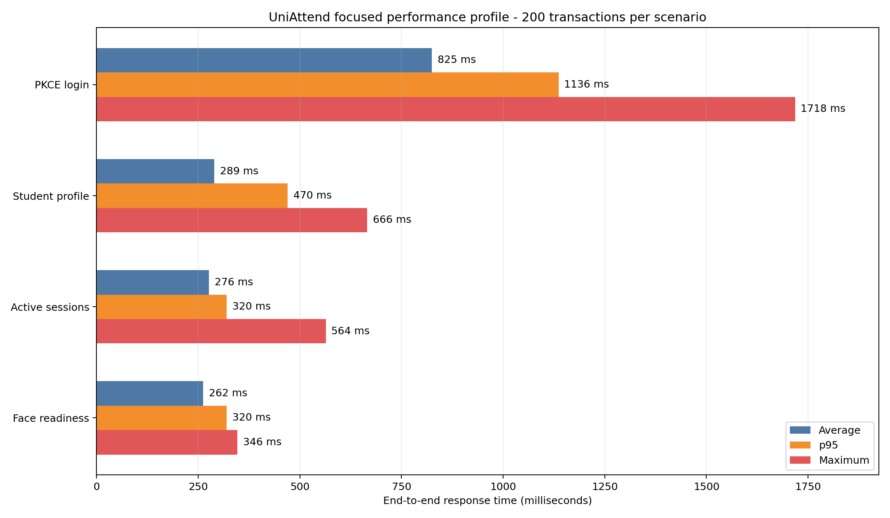

# UniAttend focused performance profile

**Executed:** 2026-09-27
**Tester:** Manushan
**Result:** Passed for the four measured single-user scenarios

## Scope

This is a short performance profile of important individual operations. It is
not a concurrency or maximum-capacity test. Load testing is recorded
separately.

The profile measured:

1. a complete mobile Keycloak authorization-code-with-PKCE login;
2. an authenticated student profile read;
3. the authenticated active-attendance-session list used by the student
   dashboard; and
4. the authenticated Face Verification readiness-status lookup.

Each scenario used one k6 virtual user and 200 measured iterations. The three
authenticated read scenarios first performed three warm-up calls. Login used
the production PKCE flow for every iteration. The built-in k6 dashboard used a
one-second aggregation period and exported one self-contained HTML report per
scenario. All test credentials remained in the protected workstation
credential file and are absent from this directory.

The 200 observations per scenario provide ten observations in the slowest 5%
of the sample, making p95 more useful than it was in the earlier 20-iteration
profile. This remains a sequential response-time profile. Concurrent demand is
measured separately during load testing.

## Environment

| Item | Tested value |
| --- | --- |
| Release image tag | `7eaf30153050b7d2c6e83220714bc1aaba9470f8` |
| VPS | netcup VPS, 4 vCPU, 7.8 GiB RAM, 125 GB root disk |
| Database | PostgreSQL 17 container on the same VPS, host `application-db` |
| Test generator | k6 v2.3.0 on the tester's Windows workstation |
| Public transport | HTTPS through Caddy and the `sslip.io` pilot hostnames |
| Test identity | Existing protected mock student account |

Application PostgreSQL was local during these tests. Internet round-trip time
between the workstation and VPS is still included because requests used the
real public HTTPS endpoints.

## Acceptance criteria

| Scenario | p95 target | Failure target |
| --- | ---: | ---: |
| Mobile PKCE login | Under 3,000 ms | 0% |
| Student profile | Under 1,500 ms | 0% |
| Active sessions | Under 1,500 ms | 0% |
| Face readiness status | Under 2,000 ms | 0% |

## Results

All 800 measured transactions passed their functional checks and performance
thresholds.

| Scenario | Iterations | Minimum | Average | Median | p95 | Maximum | Failures | Result |
| --- | ---: | ---: | ---: | ---: | ---: | ---: | ---: | --- |
| Mobile PKCE login | 200 | 671.00 ms | 824.61 ms | 771.50 ms | 1,136.20 ms | 1,718.00 ms | 0% | Pass |
| Student profile | 200 | 196.36 ms | 289.23 ms | 274.33 ms | 470.17 ms | 665.76 ms | 0% | Pass |
| Active sessions | 200 | 204.31 ms | 276.04 ms | 293.57 ms | 319.84 ms | 563.72 ms | 0% | Pass |
| Face readiness status | 200 | 199.62 ms | 262.34 ms | 239.37 ms | 319.64 ms | 346.17 ms | 0% | Pass |

The login metric covers the authorization page, credential submission,
authorization-code redirect and token exchange. The read-operation metrics
cover the public request from k6 through the relevant application service and
local database response.

## VPS observations

| Measurement | Observation |
| --- | --- |
| Highest sampled host CPU use | 60.5% instantaneous sample |
| Host memory | Maximum 2,865 MiB used; minimum 5,081 MiB available |
| Swap | 0 MiB used |
| Root disk | 15% used |
| Container restarts | Zero before and after the profile |
| Face container memory | Maximum 827.8 MiB with the model loaded |

Short per-container CPU spikes were observed during sampling. The highest
samples were 49.68% for Core and 45.18% for Face, while the highest host sample
was 60.5%. These are instantaneous two-second monitoring samples rather than
sustained utilization. Memory remained stable, swap remained unused, and no
container restarted or exceeded its memory limit.

## Interpretation

The four selected operations meet the provisional pilot thresholds across 200
sequential observations each. The results establish a stronger single-user
baseline for the next load test. They do not establish the number of
simultaneous students the deployment can support.

The Face result covers readiness-status resolution across the Face service,
Core and PostgreSQL. It does not measure InsightFace image inference. Four
generated face profiles exist in the deployed database, but no approved live
capture paired with one of those reference identities was available in the
test workspace. Reporting the status lookup separately avoids presenting a
non-inference request as model performance.

## Evidence map

For each scenario, `k6-dashboard.html` is the primary human-readable report and
`k6-summary.json` is its compact machine-readable evidence. The server resource
CSV contains the maximum sampled host and container values.

- [Login dashboard](evidence/login/k6-dashboard.html)
- [Student-profile dashboard](evidence/student-profile/k6-dashboard.html)
- [Active-sessions dashboard](evidence/active-sessions/k6-dashboard.html)
- [Face-readiness-status dashboard](evidence/face-readiness-status/k6-dashboard.html)
- `evidence/server-final.txt`
- `evidence/server-resource-summary.csv`
- `results-summary.csv`

Raw monitoring records and the superseded 20- and 100-iteration artifacts were archived
under the tester's protected `.uniattend-backups` directory. They are excluded
from this shareable set. Stable metric names were used in the dashboard rerun,
and the exported HTML files were checked for credentials and transient PKCE
parameters. No password, access token, refresh token, face image or embedding
is stored in this evidence package.
