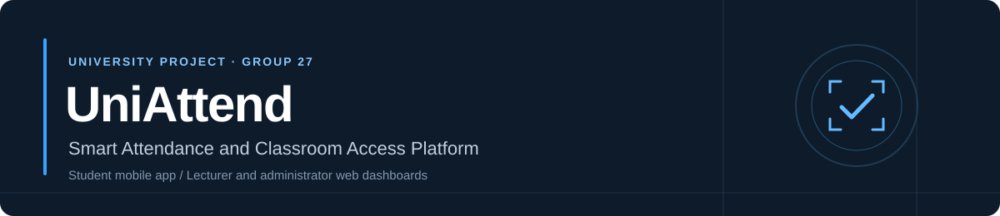
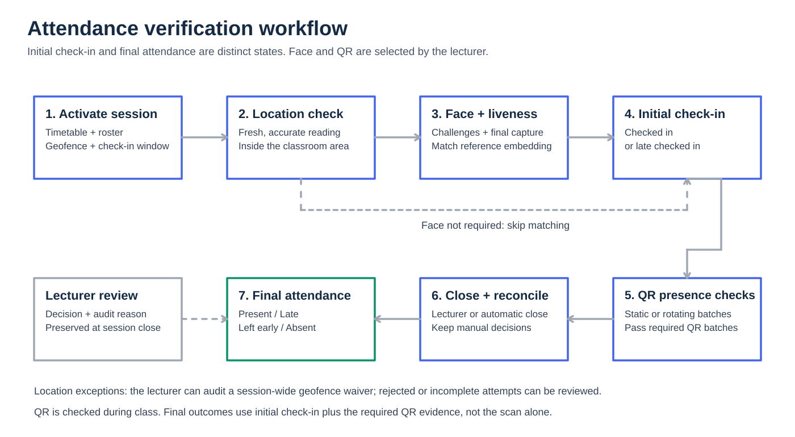
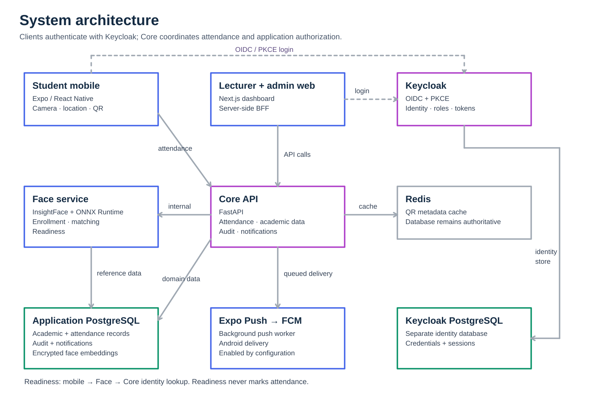
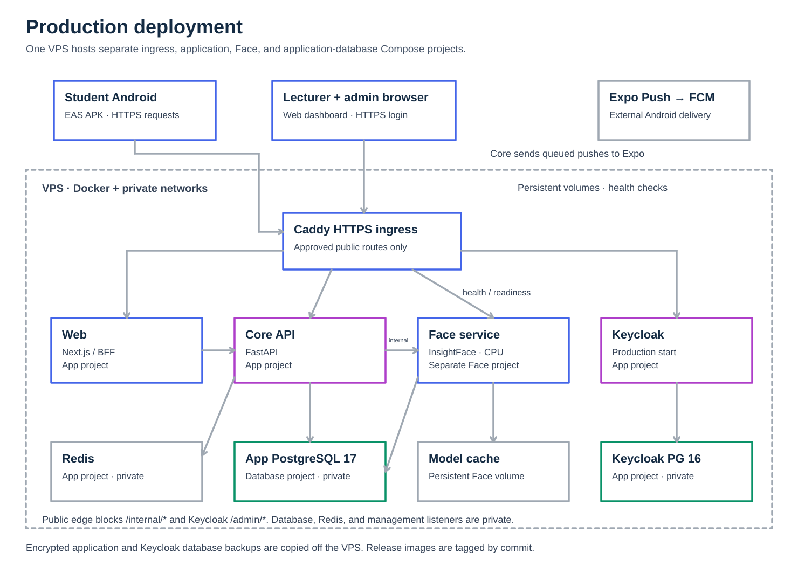

# UniAttend

<p align="center">
  
</p>

<p align="center">
  <a href="https://github.com/Smart-Attendance-Group-27/smart-attendance-platform/actions/workflows/web-ci.yml"></a>
  <a href="https://github.com/Smart-Attendance-Group-27/smart-attendance-platform/actions/workflows/mobile-ci.yml"></a>
  <a href="https://github.com/Smart-Attendance-Group-27/smart-attendance-platform/actions/workflows/backend-ci.yml"></a>
  <a href="https://github.com/Smart-Attendance-Group-27/smart-attendance-platform/actions/workflows/deployment-ci.yml"></a>
</p>

<p align="center">
  
  
  
  
  
  
</p>

<p align="center">
  
  
  
  
  
</p>

<p align="center">
  <a href="#main-features">Features</a> ·
  <a href="#attendance-verification-workflow">Verification</a> ·
  <a href="#system-architecture">Architecture</a> ·
  <a href="#getting-started">Local setup</a> ·
  <a href="#evaluator-demo-guide">Evaluation</a> ·
  <a href="#documentation">Documents</a>
</p>

UniAttend is a university attendance platform with an Android student app and
web dashboards for lecturers and administrators. It combines classroom
geofencing, optional face verification with mobile liveness challenges, and
lecturer-controlled QR checks. The backend records verification evidence,
initial check-in, and final attendance separately.

The current implementation covers attendance and classroom administration.
Physical door locks, access controllers, and IoT classroom entry are **not implemented**.

## Problem and motivation

Paper registers and shared QR codes make attendance slow to collect and
difficult to verify. A check at the beginning of a class also does not establish
whether a student stayed for the session.

UniAttend lets lecturers define verification requirements, review failures,
and reconcile attendance when a session closes. Students can see their own
progress and results; administrators maintain the academic data, classroom
locations, policies, and identity records behind those decisions.

## Main features

| Role | Implemented capabilities |
| --- | --- |
| **Student · Android** | Keycloak sign-in; enrolled courses and timetable; active sessions; geofence check-in; face readiness trials; attendance face and liveness flow; static and dynamic QR scanning; attendance history and progress; notification inbox, unread count, preferences, and push registration; student profile. |
| **Lecturer · Web** | Assigned courses and timetable; create, activate, cancel, and close sessions; monitor initial check-in and final results; manage static and rotating QR batches; review verification failures and record manual attendance with reasons; waive a session's geofence with an audit record; attendance reports and CSV exports; academic correction requests. |
| **Administrator · Web** | Provision and manage users through Keycloak; maintain courses, offerings, lecturer assignments, enrollments, and timetable entries; manage classrooms and geofences; upload reference photos for face enrollment; configure attendance policies; review correction requests; institution reports and audit logs. |

<details>
<summary><strong>Functionality limits and configuration switches</strong></summary>

- **Face attendance is optional per session.** New sessions default to face verification off. Deployment configuration can also block it with `PILOT_DISABLE_FACE_ATTENDANCE`.
- **Face matching requires enrollment.** A generated, encrypted reference embedding, the matching encryption key and model, and an active verification configuration must exist. Missing profiles cannot pass verification.
- **Liveness is evaluated on the phone.** ML Kit checks two randomized challenges drawn from head turns and an eyes-closed hold, followed by frontal confirmation. The server validates the supplied evidence's structure, supported challenges, and age; it does not independently prove liveness from video or bind evidence to a server-issued challenge.
- **Readiness trials use image matching.** They update readiness status without marking attendance; the readiness API does not require the attendance liveness evidence.
- **Push delivery and upcoming-class reminders default to off** in the supplied environments. Inbox notifications are separate from delivery. Android push needs notification permission, an EAS build with Firebase configuration, FCM credentials in EAS, a registered Expo token, and an enabled push worker.
- **Reference enrollment uses uploaded/local JPEG or PNG files.** A Cloudflare R2 photo provider is not implemented. Verification captures are processed without persistent raw-image storage; reference embeddings are encrypted in PostgreSQL.
- **Automatic session closure needs its database migration.** It defaults to on and uses the same finalization path as lecturer closure, after a configured grace period.
- **Android is the documented mobile demo target.** iOS configuration exists, but an iOS release and device validation are not established here. Face thresholds and spoof resistance still need broader evaluation.

</details>

## Attendance verification workflow



1. The lecturer creates a session from an assigned timetable slot and activates it.
   The session stores its check-in window, lateness threshold, verification
   requirements, and a snapshot of the classroom geofence.
2. The authenticated, enrolled student opens the session. The backend checks the
   location reading's distance, accuracy, freshness, and mocked-location flag.
   An audited lecturer waiver can replace the location requirement.
3. If face verification is required, the phone completes its liveness challenges
   and sends the final capture and evidence to Core. Core authenticates the
   student and delegates matching to the separate Face service.
4. Passing the required initial steps produces **Checked in** or **Late checked in**.
   This is an intermediate result.
5. During the class, the lecturer may activate required static or rotating QR
   batches. QR scans provide additional presence evidence; they are not a
   prerequisite for initial check-in.
6. Lecturer closure, or the automatic closure task, reconciles evidence and writes
   final attendance for the enrolled roster. Existing manual decisions take precedence.

| Evidence at finalization | Automatic final result |
| --- | --- |
| Initial check-in missing | **Absent** |
| Checked in; no required QR batches, or all required batches passed | **Present** or **Late**, using the check-in time |
| Checked in; some required QR batches passed, but not all | **Left early** |
| Checked in; required QR batches exist, but none passed | **Absent** |

Voided QR batches are excluded. Manual attendance requires a lecturer and a reason.

## System architecture



| Boundary | Responsibility |
| --- | --- |
| **Student app** | Camera, location, local liveness evaluation, QR scanning, and authenticated student requests. |
| **Next.js web / BFF** | Lecturer and administrator UI; server-side authentication and calls to Core. |
| **Core API** | Token validation and application identity lookup; academic data; session lifecycle; geofence and QR rules; check-in, final attendance, audit, and notifications. |
| **Face service** | Enrollment, readiness, and attendance matching with InsightFace. Attendance calls arrive through Core; readiness calls use Face directly and resolve identity through Core. |
| **Storage and delivery** | Application PostgreSQL holds domain records and encrypted embeddings. A separate PostgreSQL database belongs to Keycloak. Redis caches QR metadata. The background push worker sends through Expo to FCM for Android delivery. |

Keycloak supplies OpenID Connect login with PKCE. Core resolves the verified
token subject through `identity.users.keycloak_user_id`; application authorization
does not query Keycloak's database.

## Technology stack

| Area | Technologies in the repository |
| --- | --- |
| Web | Next.js 16.3, React 19.2, TypeScript, Tailwind CSS 4, jose, qrcode.react |
| Mobile | Expo SDK 57, React Native 0.86, Expo Router, Camera, Location, Notifications, SecureStore, ML Kit face detection |
| Core | Python 3.12, FastAPI, Pydantic, asyncpg, HTTPX, PyJWT |
| Face | FastAPI, SQLAlchemy async, InsightFace `buffalo_l`, ONNX Runtime on CPU, OpenCV, NumPy, Fernet embedding encryption |
| Infrastructure | PostgreSQL, Redis 7.4, Keycloak 26.7, Docker Compose, Caddy HTTPS ingress |
| Delivery and checks | GitHub Actions, GitHub Container Registry, EAS Android builds, Expo Push Service / FCM |
| Testing | pytest, pytest-asyncio, Vitest, Testing Library, Jest / jest-expo, k6 scripts and recorded evidence |

Production Compose uses PostgreSQL 17 for the application and PostgreSQL 16 for
Keycloak. CI reconstructs the application schema on PostgreSQL 16.

## Screenshots

<!-- OWNER TODO: attach screenshots under docs/assets/readme/screenshots/.
     Replace each pending entry with a relative image link. Redact personal data. -->

| Student app | Lecturer dashboard | Administrator dashboard |
| --- | --- | --- |
| **To fill:** dashboard and attendance progress | **To fill:** session monitor and QR management | **To fill:** academic management and reports |

## Repository structure

```text
.
├── apps/
│   ├── mobile/                 # Expo student app
│   └── web/                    # Next.js lecturer / administrator dashboards
├── services/
│   ├── core-backend/           # Core FastAPI service and tests
│   └── face-verification/      # Face API, enrollment CLI, model adapter and tests
├── database/                  # Baseline SQL, forward migrations and dev seed
├── infra/local/               # Local Keycloak and optional application DB setup
├── deployment/                # Production Compose, ingress, release and backup tools
├── docs/                      # Integration guides and README assets
├── testing/                   # k6 scripts, reports and recorded test evidence
├── .github/workflows/         # Web, mobile, backend, deployment and uptime checks
├── docker-compose.yml         # Development services; local Keycloak is a profile
└── docker-compose.production.yml  # Alternative production build configuration
```

## Getting started

The default path below runs **Keycloak, its PostgreSQL database, Redis, Core,
Face, and the web app locally**. The application database remains an external
PostgreSQL database, such as Supabase. The student app runs on an Android device
or emulator outside Docker.

### Prerequisites

- Git, Docker Desktop with Compose v2 or newer, and Node.js **24.x** with npm.
- Python **3.12** for key generation and optional native backend tests.
- An external application PostgreSQL database with the UniAttend schema.
- Android Studio / Android SDK, a compatible JDK, and an Android emulator or
  USB-debugging-enabled phone for the mobile development build.

Use a development database. For a **new, empty** database, apply
`database/smart_attendance_db_clean.sql`, then all forward migrations in filename
order, excluding `*_rollback.sql`. Development seed data is optional.
For an existing database, apply only missing migrations. See the
[local setup guide](docs/local-development.md#application-database).

### Environment variables

```powershell
Copy-Item .env.example .env
Copy-Item apps/mobile/.env.example apps/mobile/.env
```

The copied examples contain earlier deployment URLs. **Replace them with the
local settings below** and keep passwords and keys in ignored environment files.

<details>
<summary><strong>Root environment reference</strong></summary>

| Root `.env` variable | Local configuration |
| --- | --- |
| `CORE_DB_URI` | Your development PostgreSQL connection; `CORE_DB_SSL_MODE=require` for a remote TLS database |
| `FACE_DB_URI` | Leave blank to use Core's database; retain `FACE_DB_SSL_MODE=require` for that remote connection |
| `KEYCLOAK_EXPECTED_ISSUER`, `WEB_KEYCLOAK_ISSUER` | `http://localhost:8080/realms/uniattend` |
| `CORE_KEYCLOAK_JWKS_URL` | `http://keycloak:8080/realms/uniattend/protocol/openid-connect/certs` |
| `WEB_KEYCLOAK_INTERNAL_ISSUER` | `http://keycloak:8080/realms/uniattend` |
| `KEYCLOAK_ADMIN_BASE_URL`, `KEYCLOAK_ADMIN_REALM` | `http://keycloak:8080`, `uniattend` |
| `KEYCLOAK_ADMIN_PASSWORD`, `KEYCLOAK_DB_PASSWORD` | Set local passwords before starting infrastructure |
| `WEB_KEYCLOAK_CLIENT_SECRET`, `KEYCLOAK_ADMIN_CLIENT_SECRET` | Match the imported `uniattend-web` and `uniattend-provisioner` clients |
| `WEB_SESSION_SECRET`, `DYNAMIC_QR_HMAC_SECRET` | Independent random values |
| `FACE_EMBEDDING_ENCRYPTION_KEY` | A Fernet-compatible key; preserve the existing key when reusing encrypted embeddings |
| `PUSH_WORKER_ENABLED`, `REMINDER_SCHEDULER_ENABLED` | Keep `false` until push and reminder testing is configured |

</details>

Key-generation commands, account mapping, and alternate device networking are
in [docs/local-development.md](docs/local-development.md). No private value
belongs in `EXPO_PUBLIC_*`; Expo bundles those variables into the app.

### Installation

```powershell
git clone https://github.com/Smart-Attendance-Group-27/smart-attendance-platform.git
cd smart-attendance-platform
npm ci
```

Run the environment-copy commands above from this checkout.

### Start infrastructure

```powershell
docker compose --profile local-keycloak up -d keycloak-db keycloak redis
```

Open [local Keycloak](http://localhost:8080/admin) using the administrator
credentials you set in `.env`. The `uniattend` realm imports on first startup.
Set the two confidential client secrets, create the required local user accounts
and roles, and link their Keycloak IDs to application users using the
[account setup instructions](docs/local-development.md#local-accounts-and-identity-mapping).

### Start backend

```powershell
docker compose up --build -d face-verification core-api
```

The Face service loads its model once during startup and reuses it. The first
start may take longer while model files download into the persistent model volume.

### Start web

```powershell
docker compose up --build -d web
docker compose --profile local-keycloak ps
```

Open [http://localhost:3000](http://localhost:3000) and sign in as a local lecturer
or administrator. Health endpoints are at
[Core `/health/db`](http://localhost:8000/health/db) and
[Face `/health/db`](http://localhost:8001/health/db).
The development containers use copied source; rebuild a changed service to pick up edits.

### Start mobile

For an Android phone connected by USB, set `apps/mobile/.env`:

```dotenv
EXPO_PUBLIC_KEYCLOAK_ISSUER_URL=http://localhost:8080/realms/uniattend
EXPO_PUBLIC_KEYCLOAK_REALM=uniattend
EXPO_PUBLIC_KEYCLOAK_CLIENT_ID=uniattend-mobile
EXPO_PUBLIC_CORE_API_URL=http://localhost:8000
EXPO_PUBLIC_FACE_VERIFICATION_API_URL=http://localhost:8001
EXPO_PUBLIC_API_MODE=api
EXPO_PUBLIC_APP_TIMEZONE=Asia/Colombo
```

```powershell
adb reverse tcp:8000 tcp:8000
adb reverse tcp:8001 tcp:8001
adb reverse tcp:8080 tcp:8080
adb reverse tcp:8081 tcp:8081
cd apps/mobile
npx expo run:android --device --no-bundler
npx expo start --dev-client --localhost --clear
```

Use a **native development build**, since ML Kit face detection needs native
modules. Expo Go cannot run the complete face flow. See the
[networking alternatives](docs/local-development.md#android-networking)
for an emulator or a phone over Wi-Fi.

## Evaluator demo guide

<!-- OWNER TODO: attach the complete user-guide PDF on the documentation branch. -->

| Evaluation material | Attachment |
| --- | --- |
| Video walkthrough | [Watch the UniAttend demo on YouTube](https://youtu.be/UxIqQVPHDfM) |
| Complete user guide | **To fill:** PDF on the documentation branch |

Use owner-provided demo credentials shared outside Git. A repeatable demo requires
an enrolled student, an assigned lecturer, and a timetable slot at the device's
actual test location.

1. **Administrator:** show the course offering, enrollment, classroom geofence,
   and attendance policies. Enroll an approved reference photo if demonstrating face.
2. **Lecturer:** create and activate a session. For a first run, leave face and QR
   off so the location and initial check-in path can be observed.
3. **Student:** sign in on a physical Android phone, grant precise location,
   complete check-in, and show the intermediate result on both clients.
4. **QR:** repeat with QR enabled; activate a static or dynamic required batch
   and scan it on the phone. Observe its accepted result and required-batch progress.
5. **Face:** use an enrolled student with a compatible reference embedding;
   run readiness, then a face-enabled session with liveness challenges.
6. **Finalize:** close the session and compare final attendance, reports, and
   student history. Show a reasoned manual review or an audited geofence waiver.
7. **Notifications:** show the inbox. Test device delivery separately with
   FCM/EAS configured and the push worker enabled.

<details>
<summary><strong>Automated checks and test evidence</strong></summary>

From the repository root:

```powershell
npm run typecheck --workspace=apps/web
npm run lint --workspace=apps/web
npm run test:ci --workspace=apps/web
npm run build --workspace=apps/web
npm run typecheck --workspace=apps/mobile
npm run lint --workspace=apps/mobile
npm run test:ci --workspace=apps/mobile
```

For each Python service, use a separate Python 3.12 environment, install its
`requirements.txt`, and run `python -m pytest -q` from that service directory.
See the [test instructions](docs/local-development.md#automated-tests).

GitHub Actions runs these checks and reconstructs the schema and production
containers. Recorded k6 results are in [testing/](testing/), including the
[performance report](testing/performance-profile-2026-09-27/performance-test-report.md).
These are results for their recorded environment and workload, not general
capacity guarantees.

</details>

## Deployment



The production configuration uses one VPS with Caddy HTTPS ingress, an application
Compose project, a separate Face Compose project, and a private application
PostgreSQL project. Keycloak has its own PostgreSQL database. Face remains a
separate image and service boundary on the same host.

Core and Face use the same application database and the existing embedding key.
Public ingress blocks `/internal/*` and Keycloak administration; Face exposes
only approved health and readiness routes. Database and cache ports stay private.
Backup scripts create encrypted database archives for off-host copying.

CI publishes commit-tagged images to GHCR after the deployment build job passes
on `main`. Release scripts perform the server rollout; **automatic rollout after
every merge is not configured**. Mobile changes need a separate EAS artifact.

| Pilot access | Link |
| --- | --- |
| Live web dashboard | [Open UniAttend](https://app.152-53-33-198.sslip.io) |
| Android APK | [Download from the EAS build page](https://expo.dev/accounts/manushanhasanka/projects/uniattend/builds/3b387185-1304-4c57-a96f-869eef7eb554) |

See the [VPS release runbook](deployment/first-vps-runbook.md) for operations.
The `preview` EAS profile produces an APK; review its bundled public environment
before running:

```powershell
cd apps/mobile
npx eas-cli build --platform android --profile preview
```

## Documentation

| Engineering documentation | Location |
| --- | --- |
| Complete local setup, identity linking, and troubleshooting | [Local development](docs/local-development.md) |
| Database migration conventions and history | [Database migrations](database/migrations/README.md) |
| Backend authentication walkthrough | [Backend integration](docs/backend/integration-and-manual-testing.md) |
| Geofence demonstration | [Geofence guide](docs/geofence-validation-demo.md) |
| Face contracts and enrollment CLI | [Face service](services/face-verification/README.md) |
| Production operations and backups | [Deployment runbook](deployment/first-vps-runbook.md) |
| Load scripts and recorded evidence | [Testing](testing/) |
| Contribution process | [Contributing](CONTRIBUTING.md) |
| Evaluation PDFs and user guide | [Documentation branch](https://github.com/Smart-Attendance-Group-27/smart-attendance-platform/tree/docs/evaluation-reports) |

The `docs/evaluation-reports` branch holds evaluation documents separately from
application code:

| Evaluation document | PDF |
| --- | --- |
| Project Proposal | [View PDF](https://github.com/Smart-Attendance-Group-27/smart-attendance-platform/blob/docs/evaluation-reports/reports/project-proposal.pdf) |
| Software Requirements Specification (SRS) | [View PDF](https://github.com/Smart-Attendance-Group-27/smart-attendance-platform/blob/docs/evaluation-reports/reports/software-requirements-specification.pdf) |
| Software Architecture Document (SAD) | [View PDF](https://github.com/Smart-Attendance-Group-27/smart-attendance-platform/blob/docs/evaluation-reports/reports/software-architecture-document.pdf) |
| Feasibility Report | [View PDF](https://github.com/Smart-Attendance-Group-27/smart-attendance-platform/blob/docs/evaluation-reports/reports/feasibility-report.pdf) |
| Test Report | [View PDF](https://github.com/Smart-Attendance-Group-27/smart-attendance-platform/blob/docs/evaluation-reports/reports/test-report.pdf) |
| Final Report | **To fill:** PDF |
| Complete User Guide | **To fill:** PDF |

The attached PDFs preserve the owner-supplied reports. Proposal and design
documents may describe earlier plans; current source and Compose configuration
determine implemented behavior.
